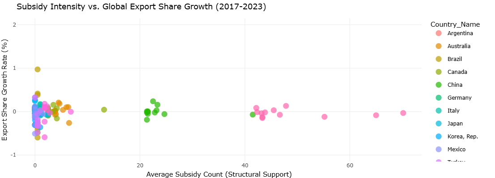

# Trade Distortion Monitor: An R-Driven Analysis of G20 Industrial Subsidies

This repository contains the full data pipeline and source code for an interactive Shiny application that tests a key hypothesis in international trade regulation: whether the **frequency of structural government subsidies** leads to measurable trade distortion.

### 🔗 Live Project Demo

Click the link below to interact with the deployed dashboard and explore the correlation findings and time series trends.

****

**[https://lukesegault.shinyapps.io/Trade_Subsidies_Server/]**

### Visual Confirmation: Global Correlation (2023)

*Figure 1: The visual clustering of data points around the horizontal axis confirms the **null relationship** between structural subsidy intensity and subsequent export growth.*
---

### Key Finding & Policy Conclusion

We tested the relationship between the **Average Subsidy Count (2018–2023)** and **Export Share Growth** for G20 industrial sectors.

| Metric | Result | Interpretation |
| :--- | :--- | :--- |
| **Correlation ($r$)** | **$r \approx -0.017$** | **Statistically Insignificant (Null Relationship)** |
| **Conclusion** | The high frequency (count) of structural subsidy measures is **decoupled** from short-term export competitiveness. |
| **Policy Takeaway** | Regulatory bodies (like the WTO) should shift their focus from tracking the **count of programs** to investigating the **financial magnitude** and **specific terms (design)** of subsidies, not just the number of programs. |

---

### Project Structure & Technical Methodology

This project demonstrates proficiency in managing and linking large, complex, real-world economic datasets using R.

#### Data Sources
* **Intervention:** World Bank *Unfair Advantage* and *Green Subsidies Database* (Structural Measures).
* **Outcome:** CEPII BACI bilateral trade flows (HS 6-digit, 2017–2023, $\approx 77$ million rows).

#### Core R Skills Demonstrated
* **Large Data Aggregation:** Use of **`data.table`** to efficiently process and summarize over 77 million trade records on limited memory.
* **Data Linkage:** Custom implementation of the **HS-to-ISIC concordance logic** to bridge product-level trade data with industry-level subsidy data.
* **Interactive Visualization:** Deployment of a live, modern dashboard using **Shiny** and **Plotly** to communicate complex time-series and correlation findings.

#### Repository Contents
| File | Description |
| :--- | :--- |
| `analysis_script.R` | The complete, clean R pipeline (data import, cleaning, aggregation, correlation calculation). |
| `ui.R` & `server.R` | Source code for the interactive Shiny web application. |
| `final_analysis_data.RData` | The final, pre-aggregated data file the Shiny app loads. |
